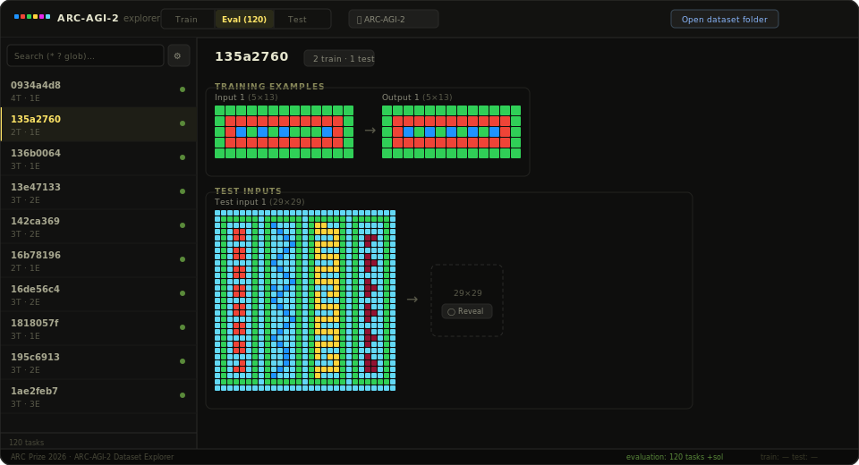

# ARC-AGI-2 Dataset Explorer

A browser-based tool for exploring, visualising, and creating solutions for
[ARC Prize 2026](https://arcprize.org/competitions/2026/arc-agi-2) tasks.


<p align="center">
  
</p>

---

## Quick Start

```bash
npm install
npm run dev       # opens http://localhost:3000
```

## Loading Data

1. Download the ARC-AGI-2 dataset from
   [GitHub](https://github.com/arcprize/ARC-AGI-2) or
   [Kaggle](https://www.kaggle.com/competitions/arc-prize-2026-arc-agi-2/data).
2. Click **Open dataset folder** and select the root folder.
3. The explorer auto-detects the structure and loads all available splits
   (train, evaluation, test) along with any solution files.

**Supported folder layouts:**

| Format | Structure |
|--------|-----------|
| **GitHub** (individual files) | `data/training/*.json`, `data/evaluation/*.json`, `data/test/*.json` |
| **Kaggle** (consolidated) | `arc-agi_training_challenges.json`, `arc-agi_evaluation_solutions.json`, etc. |

Both formats can coexist in the same folder — the loader merges them.

## Features

| Feature | Description |
|---------|-------------|
| **One-click folder load** | Point to the dataset root; all splits and solutions are discovered automatically |
| **Task browser** | Searchable sidebar listing every task with train/test counts |
| **Grid visualiser** | Auto-scaled colour grids for every training and test pair |
| **Per-solution reveal** | Each solution is hidden by default with its own Reveal / Hide toggle |
| **Grid editor** (test set only) | Full editor with paint, select, region fill, copy/paste tools |
| **Keyboard shortcuts** | Ctrl+C, Ctrl+V, Ctrl+Z work in the editor |
| **Persistent solutions file** | Link a JSON file that auto-updates on every save (File System Access API) |
| **Auto-save** | Created solutions also persist in `localStorage` across sessions |

## Editor Tools (Test Set Only)

The editor appears only when working with the **test** split, since train and
evaluation sets already have ground-truth solutions.

- **✏️ Paint** — click or drag to colour individual cells
- **⬚ Select** — drag a rectangular region; then Copy / Paste / Fill
- **🪣 Fill** — fill the current selection (or a single cell) with the active colour

**Keyboard shortcuts** (active while the editor is open):

| Shortcut | Action |
|----------|--------|
| `Ctrl+C` / `⌘C` | Copy the current selection |
| `Ctrl+V` / `⌘V` | Paste clipboard at selection origin |
| `Ctrl+Z` / `⌘Z` | Undo last grid change (up to 50 steps) |

Additional actions: **Copy input** (clone the test input as starting point),
**Clear** (reset grid to black), resize via **R/C** controls (1–30).

## Persistent Solutions File

When you open the dataset folder, the explorer **automatically** finds or
creates `arc-agi_test_solutions.json` in the root of your dataset directory:

1. Click **Open dataset folder** and select your ARC-AGI-2 data root.
2. The explorer scans for challenges, official solutions, **and** any existing
   `arc-agi_test_solutions.json`.
3. If the file exists, your previously edited solutions are imported
   and the yellow sidebar dots reappear immediately.
4. If the file doesn't exist, it is created automatically.
5. Every subsequent save writes the complete solutions object back to that
   file — including 1×1 placeholder grids for unsolved tasks.

**After a browser restart**, just open the same folder again — your work is
picked up automatically. A green indicator (`● arc-agi_test_solutions.json`)
appears in the top bar confirming the file is linked and auto-saving.

This uses the [File System Access API](https://developer.mozilla.org/en-US/docs/Web/API/File_System_API)
with `showDirectoryPicker` (Chrome / Edge). On unsupported browsers
(Firefox / Safari) the folder is opened via `<input webkitdirectory>` and
solutions are imported on load, but auto-write is not available — a
**Download** button appears as a fallback instead.

---

## Project Structure

```
arc-agi-explorer/
├── public/
│   └── favicon.svg              # Colourful grid icon
├── src/
│   ├── components/              # UI components (one per file)
│   │   ├── index.js             #   Barrel export
│   │   ├── Grid.jsx             #   Read-only ARC grid renderer
│   │   ├── EditableGrid.jsx     #   Interactive grid with tool support
│   │   ├── ColorPalette.jsx     #   10-colour swatch strip
│   │   ├── SolutionEditor.jsx   #   Full editor panel (tools + palette + grid)
│   │   ├── TaskView.jsx         #   Main content: training + test grids
│   │   ├── EditorPanel.jsx      #   Split view: reference + editor
│   │   ├── Sidebar.jsx          #   Left sidebar task list
│   │   ├── TopBar.jsx           #   Top nav: tabs + folder picker + solutions file
│   │   └── StatusBar.jsx        #   Bottom status strip
│   ├── constants/               # Static configuration
│   │   ├── colors.js            #   ARC 10-colour palette
│   │   ├── sets.js              #   Dataset split definitions
│   │   └── tools.js             #   Editor tool definitions
│   ├── context/
│   │   └── AppContext.jsx       #   Shared app state (React Context)
│   ├── utils/                   # Pure helper functions
│   │   ├── grid.js              #   Grid creation, deep copy, cell sizing
│   │   ├── storage.js           #   localStorage persistence
│   │   └── fileIO.js            #   Folder scanning, JSON loading, persistent file API
│   ├── App.jsx                  # Root layout composition
│   ├── main.jsx                 # Entry point
│   └── index.css                # Global styles + CSS variables
├── index.html
├── vite.config.js
├── package.json
├── .gitignore
└── README.md
```

### Architecture Notes

- **Context-driven state** — all shared state lives in `AppContext.jsx`,
  consumed everywhere via the `useApp()` hook. No prop drilling.
- **One component per file** — every visual building block is isolated,
  making any piece straightforward to modify or replace.
- **Constants are separated** — colours, tool definitions, and set metadata
  live in `src/constants/` so you can tweak them without touching UI code.
- **Utilities are pure functions** — `src/utils/` has zero React dependencies;
  they can be unit-tested in isolation.
- **Auto-detect dataset format** — `fileIO.js` handles both per-task files
  (GitHub layout) and consolidated JSON (Kaggle layout) transparently.

## Solution Export Format

Exported JSON matches the official ARC-AGI solution format:

```json
{
  "task_id": [
    [[0, 1, 2], [3, 4, 5]]
  ]
}
```

Each key is a task ID; its value is an array of 2-D grids (one per test input).

## License

MIT
